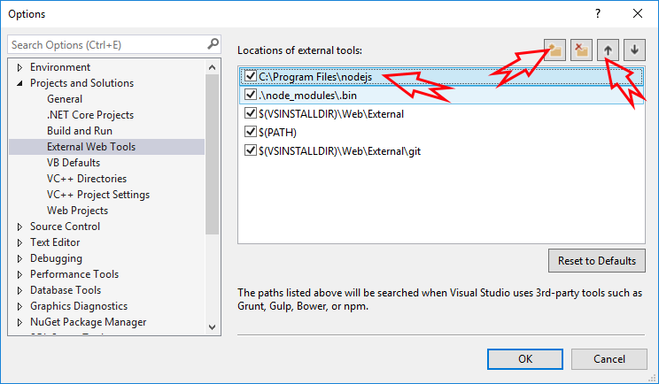

# Getting Started

The best and fastest way to get your hands dirty on Serenity is _SERENE_, which is a sample application template.

You have three options to install _SERENE_ template:

> Please check prerequisites below before trying to install Serene.

* [Installing SERENE from Visual Studio Marketplace (Windows)](installing_serene_from_visual_studio_gallery.md)

* [Installing SERENE directly from Visual Studio (Windows)](installing_serene_directly_from_visual_studio.md)

* [Installing SERENE for Asp.Net Core with SERIN (Linux, OSX, Windows)](instaling-serene-aspnet-core-version-with-serin.md)

## Prerequisites

### Visual Studio Version

Serene .NET Framework version (ASP.NET MVC 4) requires _Visual Studio 2017_ or _Visual Studio 2015_ with **Update 3** installed. 

If you have Visual Studio 2015, please make sure that you have **Update 3** installed by looking at Help => About


> It might be possible to work with Visual Studio 2013 as well but you'll have many intellisense errors as TypeScript 2.5.2 can't be installed in VS2013.

Serene ASP.NET Core 2.0 version only works in Visual Studio 2017, or using command line.

> Microsoft recently obsoleted *project.json* based projects and replaced them with a lighter version of *MsBuild* based *CSPROJ* projects. This new project system only works in Visual Studio 2017, so if you want to work with .NET Core version of Serene, either you need to use Visual Studio 2017 or go lighter with Visual Studio Code / Command Line.

### .NET Core SDK

If you are going to use ASP.NET Core version of Serene, please install .NET Core 2.0 SDK from:

https://www.microsoft.com/net/download/core

### Visual Studio TypeScript Extension

As of writing, the recommended version of TypeScript is 2.5.2. 

Even though Serene uses NodeJS based TypeScript compiler (tsc) on build, Visual Studio still uses its own version of TypeScript for intellisense and refactoring etc. If you have an older version of that extension, you'll be greeted with many errors as soon as you open a Serene project.

To check what version of TypeScript Visual Studio Extension you have, again see Help => About:


Visual Studio 2017 comes with TypeScript 2.1.5 by default, but Visual Studio 2015 might include older versions.

If you have something lower than 2.3.4 there, you might need to install TypeScript for Visual Studio extension.

> TypeScript version you see in Control Panel / Add Remove Programs doesn't matter at all. What matters is the one  that is enabled in Visual Studio.

TypeScript versions after 1.8.6 requires Visual Studio 2015 Update 3 to be installed first, so even if you try to install the extension it will raise an error, so please first install Update 3.

You can get TypeScript extension for your Visual Studio version from http://www.typescriptlang.org/#download-links.

Here is the link for Visual Studio 2015:

[https://www.microsoft.com/en-us/download/details.aspx?id=48593](https://www.microsoft.com/en-us/download/details.aspx?id=48593)

But **don't click the download button** right away. Expand **Details** section, and select the exact version you need (e.g. 2.5.2):


Latest version of TypeScript might probably work but keeping in sync with the version we currently use, can help you avoid compatibility problems that could come with them.

### NodeJS / NPM

Serene uses NodeJS / NPM for these:

- TypeScript typings (.d.ts) for libraries like jQuery, Bootstrap etc. 
- TypeScript compiler itself (tsc)
- Less compilation (lessjs)
- T4 Code generation by parsing TypeScript sources

It requires NodeJS v6.9+ and NPM 3.10+

Serene will check their versions on project creation and ask for confirmation to download and install them. Anyway, please check your versions manually by opening a command prompt:

```cmd
> npm -v
3.10.10
```

```cmd
> node -v
6.9.4
```

If you get an error, they might not be installed or not in path. Please install LTS (long term support) versions from [https://nodejs.org/en/](https://nodejs.org/en/)

> Current version might also work but is not tested.

### Visual Studio and External Web Tool Paths

Even if you have correct Node / NPM installed, Visual Studio might still be trying to use its own integrated, and older version of NodeJS.

Click _Tools_ => _Options_, and then under _Projects and Solutions_ => _External Web Tools_ add _C:\Program Files\nodejs_ to the top of the list by clicking plus folder icon, typing _C:\Program Files\nodejs_ and using _Up Arrow_ to move it to the start:

