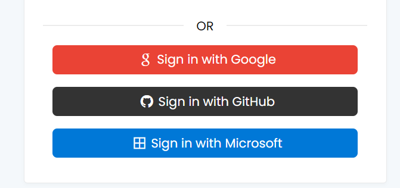
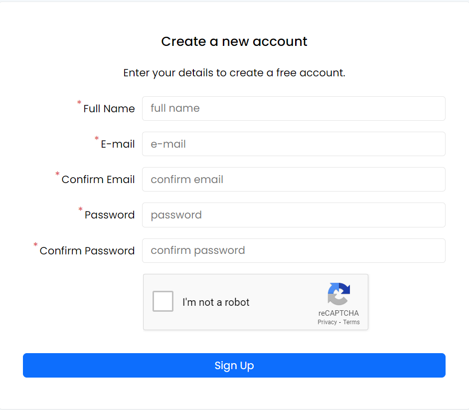
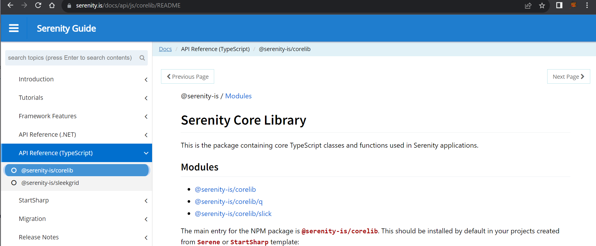

# Serenity 6.8.0 Release Notes (2023-08-14)

## New Serenity.Pro.OpenIdClient Feature Package

This update introduces the `Serenity.Pro.OpenIdClient` package enabling seamless external login via Google, Microsoft, GitHub and more. 



The implementation also includes robust account link / unlink actions to associate existing accounts with such external logins.


As link / unlink pages requires account elevation (e.g. re-entering the password), you should register default implementation for `IElevationHandler` in your Startup.cs.

This package is only available to Business/Enterprise customers. Please see StartSharp repository for documentation about integration of external logins to an existing project.

## Mitigation for potential XSS attack via login page returnURL

To thwart potential XSS attacks via email links, a critical security measure has been implemented. 

The LoginPage.tsx now incorporates a defensive check to only accept return URLs that begin with a forward slash (/). 

> Our gratitude to Tasfaout Abderrahim for bringing this to our attention.

Please apply the check in LoginPage.tsx that looks like `if (returnUrl && /^\//.test(returnUrl)) {` to your existing projects.

## SettingStorage Interface Allows Returning Promises

The SettingStorage module has undergone modifications to enhance performance and security. The getItem and setItem methods may now return Promises, eliminating synchronous XHR calls.

```ts
interface SettingStorage {
    getItem(key: string): string | Promise<string>;
    setItem(key: string, value: string): void | Promise<void>;
}
```

Consequently, similar adjustments extend to the DataGrid's restoreSettings, persistSettings, and getPersistedSettings methods.

Users with custom code using these methods must ensure compatibility with the Promise return type (e.g., utilize async operations).

Furthermore, a new `restoreSettingsFrom` method takes precedence over restoreSettings in mixins, derived classes, etc. It's important to note that `restoreSettingsFrom` does not handle null settings parameter (e.g. load from defaults).

## ExtensionWhitelistInclude/Exclude and ExtensionBlacklistInclude/Exclude

We previously added an appsettings.json setting that allows blacklisting / whitelisting extensions.

It included `ExtensionWhitelist` and `ExtensionBlacklist` properties with sensible defaults.

If you overridden these properties in appsettings.json etc. you would have to list the defaults in addition to the ones you wanted to include/exclude.

To make it easier to include/exclude additional extensions, there are now `ExtensionBlacklistInclude`, `ExtensionBlacklistExclude`, `ExtensionWhitelistInclude` and `ExtensionWhitelistExclude` properties that you may use instead of overriding the defaults (which should be avoided).

## Q.initFullHeightGridPage Method Uses Flex Layout

Previously, initFullHeightGridPage used to set the height of passed `GridDiv` by calculating it based on window height and other vertical panels in the same page. It also attached to the resize event to recalculate the height when the window size changes. 

Altough it worked fine for most cases, it caused some issues especially with responsive layouts, e.g. in mobile pages and made it harder to apply CSS rules based on `@media` queries.

We modified the `initFullHeightGridPage` function so that it takes advantage of `flex` layout system instead of manually calculating the best height. This requires the `section.content` to use flex layout as well and some other CSS rules. Updating `Serenity.Pro.Theme` should generally be enough but Serene users might have to apply latest changes in `common-theme.css` file manually.

You may pass `{ setHeight: true }` in second parameter to get the old legacy behavior.

## Restored ReCaptcha Functionality

During the switch to .NET dependency injection, the captcha widget became non functional as it was not possible to access app configuration containing site key and secret key from the form definition itself.

We implemented a custom property processor, making use of dependency injection and captcha editors should work again. We integrated a sample into the Signup form.



Don't forget to set `Recaptcha:SiteKey` and `Recaptcha:SecretKey` in appsettings.json.

## IUserClaimCreator Interface for creating ClaimsPrincipal

There was a static `CreatePrincipal` method in `UserRetrieveService` in StartSharp/Serene that was used in the login page to create a ClaimsPrincipal when a user logs in. It was possible to add custom claims to the principal by modifying the method.

But it was not possible to access this method from feature packages, so we now abstracted it into a separate interface `IUserClaimCreator`. The default implementation for it is available as `DefaultUserClaimCreator`. If you need to add custom claims you should inherit this class and override its methods.

You should add `services.AddSingleton<IUserClaimCreator, DefaultUserClaimCreator>` to `Startup.cs` file, and inject `IUserClaimCreator` instead of the static method in `UserRetrieveService`.

## Applied patch for jQuery UI touch events

As jQuery UI does not support touch events for mobile devices, and SlickGrid, dialogs and several other widgets still depend on jQuery UI, it was not possible to reorder columns, group by columns in mobile devices.

We applied a touch events patch to `jquery-ui.js` file (our custom, compact version of jquery-ui) so those touch actions should work.

## Compact version of `Texts.ts` file

The `Texts.ts` file containing a `Q.proxyTexts` call was generating code in one line containing all the local text keys similar to following:

```ts
StartSharp['Texts'] = proxyTexts(Texts, '', {Db:{Administration:{Language:{Id:1,LanguageId:1,LanguageName:1},Role:{RoleId:1RoleKey:1,RoleName:1},RolePermission:{PermissionKey:1,RoleId:1,RoleName:1,RolePermissionId:1},User:{DisplayName:1,Email:1,ImpersonationToken:1,InsertDate:1,//...
```

This lead to merge conflicts whenever two feature branches introduced new text keys.

We now create a multi line formatted and compact version excluding text key leaves (only groups):

```ts
    StartSharp['Texts'] = proxyTexts(Texts, '', {
        Db: {
            Administration: {
                Language: {},
                //...
            }
        },
        Forms: {
            Membership: {
                Login: {},
                SendActivation: {},
                SignUp: {}
            }
        },
        //...
    }) as any;
```

Which should cause less conflicts and easier to read.

## Set Content-Disposition Header for Report Preview

When you preview a PDF report, and try to save it, it always produced a file named `Render.pdf`. We now set the `Content-Disposition` header properly, so that when you try to save the file, you'll get a default file name based on report type etc. just like when you download the report.

## Password related account actions are moved to Serenity.Extensions

Password related pages and their services, like Forgot Password, Reset Password, Change Password etc. were directly implemented in StartSharp/Serene under `Modules/Membership/Account` making them harder to update whenever we change something.

We now moved that code into `Serenity.Extensions` NuGet package. There is just a one liner in `Serene/StartSharp`:

```cs

[Route("Account/[action]")]
public class AccountPasswordActionsPage : AccountPasswordActionsPageBase<UserRow>
{
}
```

For this to work, `UserRow` in your project should implement a few extra interfaces:


```cs
public sealed class UserRow : Serenity.Extensions.Entities.LoggingRow<UserRow.RowFields>, 
    IIdRow, INameRow, IIsActiveRow, 
    IDisplayNameRow, IEmailRow, IPasswordRow // new interfaces
{
    //...
    StringField IDisplayNameRow.DisplayNameField => fields.DisplayName;
    StringField IEmailRow.EmailField => fields.Email;
    StringField IPasswordRow.PasswordHashField => fields.PasswordHash;
    StringField IPasswordRow.PasswordSaltField => fields.PasswordSalt;
}
```

It is still possible to copy that code into your project and customize, but is not recommended.

## Serenity.Pro.UI is obsoleted, rewrote Email Client sample with jsx-dom

Serenity.Pro.UI which was only used by Email Client sample will no longer be available as we rewrote the Email client with jsx-dom. 

If you have reference to `Serenity.Pro.UI` in your project, you may safely remove it after updating `Serenity.Pro.EmailClient` to the latest version (if you use it).

The e-mail client sample also got a visual overhaul in addition to a mock IMAP server implementation for demo purposes.


## DevelopmentMode should be removed from Web.config

Due to the ASP.NET Core sample we based StartSharp/Serene initially, there may be a setting in your project web.config file like the following:

```xml
<environmentVariables>
    <environmentVariable name="ASPNETCORE_ENVIRONMENT" value="Development" />
```

Unfortunately this line stays there even after deployment, so your web site might be running in Development mode.

We recommend removing that line from web.config file to avoid having to manually removing that after publish.

## API documentation for Serenity TypeScript Code

We generated API documentation for @serenity-is/corelib and @serenity-is/sleekgrid packages via TypeDoc and made them available at https://serenity.is/docs under Api Reference (TypeScript) section.



## JSX-DOM Integration

We added `jsx-dom` (https://github.com/alex-kinokon/jsx-dom) integration which is a library similar to React. but which directly creates HTML elements instead of using a VDOM. 

It offers better compatibility with existing Serenity Widget structure that use jQuery and contains code that modify DOM directly. 

It will mostly be used in renderContents() method instead of the getTemplate() so that events can be bound at widget creation, and references to elements can be acquired. 

There is currently no dependency to jsx-dom in @serenity-is/corelib itself but it exposes a jsxDomWidget method than can be used to create a jsx-dom compatible functional component from a widget type, like:

```ts
var StringEditor_ = jsxDomWidget(StringEditor); 
return `<StringEditor_ readonly={true} maxlength={50} />`
```

We used JSX-DOM on several places in Serene/StartSharp code, including membership related pages like Login / Signup / Password actions etc.

```jsx
protected renderContents() {
    const id = this.useIdPrefix();
    const myTexts = Texts.Forms.Membership.Login;
    const returnUrl = this.getReturnUrl();
    this.element.empty().append(<>
        <AccountPanelTitle />
        <div class="s-Panel p-4">
            <h5 class="text-center my-4">{myTexts.LoginToYourAccount}</h5>
            <form id={id.Form} action="">
                <div id={id.PropertyGrid}></div>
                <div class="px-field">
                    <a class="float-end text-decoration-none" href={resolveUrl('~/Account/ForgotPassword')}>
                        {myTexts.ForgotPassword}
                    </a>
                </div>
```

Added useIdPrefix() and Widget.useIdPrefix() methods to make it easier to generate unique ID's based on the Widget's idPrefix in jsx-dom based code similar to ~_ prefix in classic templates.

## Switched to JSX automatic runtime

- https://www.typescriptlang.org/tsconfig#jsxImportSource

Switched to JSX automatic runtime in StartSharp by setting "jsx": "react-jsx" and "jsxImportSource": "jsx-dom" in tsconfig.json. 

If you need to use React or Preact etc. in one your .tsx files, you may switch the runtime by adding a pragma comment on top of the file like /** @jsxImportSource react */.

## Page.tsx Files are also considered as ESM Entry Points

In addition to `**/*Page.ts` files, `**/*Page.tsx` files are also considered as ESM entry points for esbuild in tsbuild and sergen now.

## Replaced toastr with an embedded version

Replaced `toastr` with an embedded version rewritten in TypeScript adapted from:

- https://raw.githubusercontent.com/JPeer264/toastr2/master/src/Toastr.ts. 

This will make it possible to show notifications which failed when toastr.js is not loaded in the page. 

You may remove toastr.js from appsettings.bundles.json but leave toastr.css for now as it is still required.

## Obsoleted IExceptionLogger

IExceptionLogger interface is obsolete! 

Please log exceptions directly via .NET's ILogger interface and its LogError method. 

StartSharp users should replace app.UseExceptional() line with app.UseExceptionLogger() in Startup.cs, which also enables implicit logging to StackExchange.Exceptional via the new `InformationalException` type.

## parseDateTime and parseISODateTime no longer returns `false` [Breaking Change]

Q.parseDate and Q.parseISODateTime functions returns an Invalid Date instance (e.g. its .valueOf() method returns NaN) instead of "false" or "null" as they used to be, which was a wrong decision at time. 

It was causing invalid dates to be considered equal to empty dates sometimes. 

Javascript Date constructor also returns a Date instance with NaN value for invalid dates and this change promotes consistency.

## New UI Elements Samples

There is a new navigation group in StartSharp demo containing UI/Bootstrap related samples:


We are planning to add more samples to this category related to UI components and Bootstrap widgets.