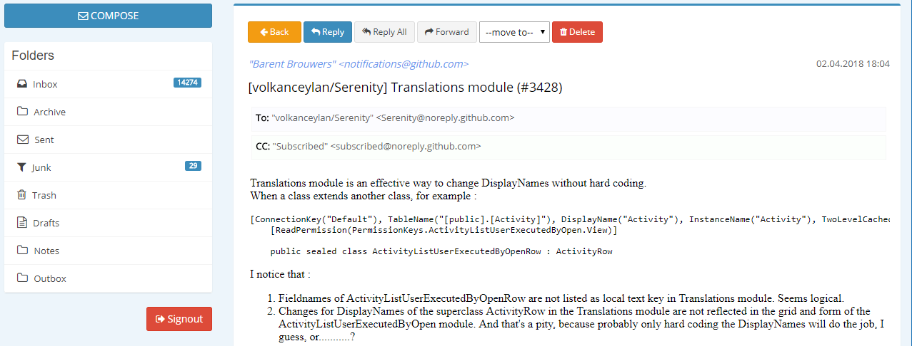

# Email Client (React Based)

StartSharp comes with a full-featured IMAP based e-mail client written with React. 

It can connect to any e-mail account supporting IMAP protocol, like Gmail, Hotmail, Yandex, Yahoo in addition to your local mail server.

We use MailKit for connecting to servers.

Here are some screenshots from the new sample:




---
# Email Client as Custom Feature

When you need to customize the source code of the sample projects, you can use them as a custom feature. To configure custom feature, you need to follow below instructions.

# Setup

Create a `my-features`, `features` or similar folder for your custom features and copy the files in [this directory](https://github.com/serenity-premium/startsharp/tree/master/docs/samples/my-features), including:

- .editorconfig
- Directory.Build.props
- Directory.Build.targets
- tsconfig.base.json
- sergen.base.json

The `Directory.Build.props` and `Directory.Build.targets` files are special files. Check [this microsoft documentation link](https://learn.microsoft.com/en-us/visualstudio/msbuild/customize-by-directory) for more details. They customized for features only. Don't place it near your main project or parent directory. This is why we use subfolder for feature projects. 

## The Directory Layout for Features Folder

Create a folder under the project directory with name something like `my-features`. The folder structure should look like this:

- `C:\..\MyProjectRoot\`
	- MyProject.sln
	- MyProject.Web\
		- MyProject.Web.csproj
	- `my-features\`
		- .config\
			- sergen.base.json
		- tsconfig.base.json
		- .editorconfig
		- Directory.Build.props
		- Directory.Build.targets
		- MyProject.MyFeature1\
		- MyProject.MyFeature2\

Note:
If you try to put these `Directory.Build.props` and `Directory.Build.targets` files near your main project, the main project will also automatically try to use them and you will have build errors.

Wrong Implementation:
- `C:\..\MyProjectRoot\`
	- MyProject.sln
	- .config\
		- sergen.base.json
	- tsconfig.base.json
	- .editorconfig
	- Directory.Build.props
	- Directory.Build.targets
	- MyProject.Web\
		- MyProject.Web.csproj
	- MyProject.MyFeature1\
	- MyProject.MyFeature2\

## Copy The Email Client Source Code

After you created the folder structure, you can copy the [Serenity.Pro.EmailClient](https://github.com/serenity-premium/startsharp/tree/master/pro-features/src/Serenity.Pro.EmailClient) source code to the `my-features` folder. 

- `C:\..\MyProjectRoot\`
	- MyProject.sln
	- MyProject.Web\
		- MyProject.Web.csproj
	- `my-features\`
		- .config\
			- sergen.base.json
		- tsconfig.base.json
		- .editorconfig
		- sergen.base.json
		- Directory.Build.props
		- Directory.Build.targets
		- Serenity.Pro.EmailClient\

## Updating The `tsconfig.json` File

We copied the `tsconfig.base.json` file under the `my-features` directory. Now we need to apply this config to our `EmailClient` feature. We need to extend our `tsconfig.json` from the `tsconfig.base.json`. 

Replace the `"extends": "@serenity-is/extensions/tsconfig.base.json"` with `"extends": "../tsconfig.base.json"`. 

```diff
{
- "extends": "@serenity-is/extensions/tsconfig.base.json",
+ "extends": "../tsconfig.base.json",
  "compilerOptions": {
    "jsxImportSource": "preact",
    "outDir": "./out",
    "paths": {
      "@/*": [
        "./Modules/*"
      ]
    }
  },
  "include": [
    "Modules"
  ]
}
```

## Updating The `packages.json` File

We need to do a small addition to our `packages.json` to run `tsbuild` script. Add `@serenity-is/tsbuild` as dev dependency to your `packages.json`.

```diff
{
  "name": "@serenity-is/pro.emailclient",
  "dependencies": {
    "preact": "10.19.3"
  },
+ "devDependencies": {
+   "@serenity-is/tsbuild": "8.0.1"
+ },
  "main": "dist/index.js",
  "private": true,
  "scripts": {
    "build": "node ./tsbuild.js",
    "build:watch": "node ./tsbuild.js --watch",
    "tsc": "tsc"
  },
  "type": "module",
  "types": "dist/index.d.ts"
}
```

## Ensuring The `sergen.json` Points The Right File

The `sergen.json` should points the right directory. We already copied the `.config/sergen.base.json` file in to our `my-features` directory. 

```json
{
  "Extends": "../.config/sergen.base.json"
}
```

## Updating The `Serenity.Pro.EmailClient.csproj` File

You can simplify the project file. The references already has condition but you can remove the conditions. The `CFPackageVersion` is the `Common Features Package Version` which is defined in `Directory.Build.props`

```diff
<Project Sdk="Microsoft.NET.Sdk.Razor">
  <ItemGroup>
    <PackageReference Include="Bogus" Version="35.4.0" />
-   <PackageReference Include="Serenity.Extensions" Version="$(CFPackageVersion)" Condition="!Exists('..\..\..\common-features\src\Serenity.Extensions\Serenity.Extensions.csproj')" />
+   <PackageReference Include="Serenity.Extensions" Version="$(CFPackageVersion)" />
    <PackageReference Include="WaffleGenerator.Bogus" Version="4.2.1" />
-   <ProjectReference Include="..\..\..\common-features\src\Serenity.Extensions\Serenity.Extensions.csproj" Condition="Exists('..\..\..\common-features\src\Serenity.Extensions\Serenity.Extensions.csproj')" />
  </ItemGroup>
  <ItemGroup>
    <TypingsToPackage Remove="wwwroot\index.d.ts" />
    <TSBuildOutputs Remove="dist\index.js;wwwroot\index.js;wwwroot\index.d.ts" />
    <TSBuildOutputs Include="esm\%(TSEntryPoints.Directory)%(Filename).js" />
  </ItemGroup>
</Project>
```

## Adding Project Reference

After completing these steps, you can add the `Serenity.Pro.EmailClient` to your main project as project reference. You can do this in the Visual Studio or you can add below lines to your project file.

Add below lines to your `MyProject.Web.csproj` file:
```xml
<ItemGroup>
  <ProjectReference Include="..\my-features\Serenity.Pro.EmailClient\Serenity.Pro.EmailClient.csproj" />
</ItemGroup>
```

## Adding `TypeSource` To Your Main Project

Open your `TypeSource.cs` file and add the feature project assembly to the `GetAssemblyList` method.

```diff
private static Assembly[] GetAssemblyList()
{
    return
    [
        typeof(LocalTextRegistry).Assembly,
        typeof(ISqlConnections).Assembly,
        typeof(IRow).Assembly,
        typeof(SaveRequestHandler<>).Assembly,
        typeof(IDynamicScriptManager).Assembly,
        typeof(EnvironmentSettings).Assembly,
        typeof(BackgroundJobManager).Assembly,
        typeof(Startup).Assembly,
+       typeof(Serenity.Pro.EmailClient.MailboxPage).Assembly
    ];
}
```

## Adding Navigation Item

Open your navigation file, customize and add this navigation item. 

```csharp
[assembly: NavigationLink(7951, "Email Client (IMAP)", typeof(Serenity.Pro.EmailClient.MailboxPage))]
```

And everything should be working like a charm. 

## Shortcut For These Steps

You can follow [this link](https://github.com/serenity-premium/startsharp/tree/master/docs/samples/my-features) to copy related files. The `Serenity.Pro.EmailClient` directory contains the files to which these changes are applied.

---
> You can update the serenity version in the `Directory.Build.props`. The variable names are `SerenityVersion`, `CFPackageVersion`, `ProPackageVersion`. When you change the version numbers here, every project uses these new versions under the `my-features` directory.

```xml
<SerenityVersion Condition="'$(SerenityVersion)' == ''">8.3.5</SerenityVersion>
<CFPackageVersion Condition="'$(CFPackageVersion)' == ''">8.3.5</CFPackageVersion>
<ProPackageVersion Condition="'$(ProPackageVersion)' == ''">8.3.5</ProPackageVersion>
```

> You can follow the [link](https://github.com/serenity-premium/startsharp/tree/master/docs/samples/my-features) to find the related files. 