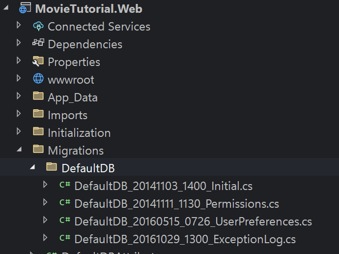
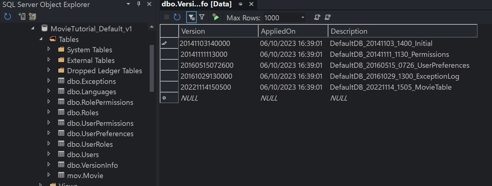

# Creating Movie Table


To store a list of movies, we'll need a `Movie` table. While you could create this table using traditional SQL Management Studio methods, we prefer to create it as a *migration* using *Fluent Migrator*. Fluent Migrator is a .NET migration framework, similar to Ruby on Rails Migrations. Migrations provide a structured approach to modifying your database schema, eliminating the need for manual execution of numerous SQL scripts by each developer involved. Migrations effectively address the challenge of evolving a database schema across multiple databases, such as the developer's local database, the test database, and the production database. Database schema changes are described in C# classes that can be version-controlled. For more information, visit [FluentMigrator on GitHub](https://github.com/schambers/fluentmigrator).

> Please Note: While we use FluentMigrator in our examples, it's important to clarify that Serenity does not have a direct dependency on migrations. You are not obligated to use migrations. Serenity functions without them. If you prefer, you can manually create tables in SQL Management Studio or work with an existing database.

## Locating the Migration Folder

To find the Migration Folder, use the *Solution Explorer* to navigate to `Migrations/DefaultDB`.



Within this folder, you'll discover several migrations. Think of a migration as a Data Manipulation Language (DML) script that alters your database's structure. For instance, `DefaultDB_20141103_1400_Initial.cs` represents the initial migration responsible for creating the `Language` table and the `Users` table.

## Creating a New Migration for the Movie Table

Create a new migration file and name it `DefaultDB_20221114_1505_MovieTable.cs`. You can duplicate one of the existing migration files, change its name, and modify its contents to suit your needs. While the migration file name and class name are not critical, it's advisable to maintain consistency and ensure proper ordering. For Serenity applications, we prefer the format `{TheDB}_yyyyMMdd_HHmm_{Description}`.

Your migration file should resemble the following:

```csharp
using FluentMigrator;

namespace MovieTutorial.Migrations.DefaultDB;

[DefaultDB, MigrationKey(20221114_1505)]
public class DefaultDB_20221114_1505_MovieTable : AutoReversingMigration
{
    public override void Up()
    {
        Create.Table("Movie")
            .WithColumn("MovieId").AsInt32()
                .Identity().PrimaryKey().NotNullable()
            .WithColumn("Title").AsString(200).NotNullable()
            .WithColumn("Description").AsString(1000).Nullable()
            .WithColumn("Storyline").AsString(Int32.MaxValue).Nullable()
            .WithColumn("Year").AsInt32().Nullable()
            .WithColumn("ReleaseDate").AsDateTime().Nullable()
            .WithColumn("Runtime").AsInt32().Nullable();
    }
}
```

In the `Up()` method, we specify that this migration will create a table named `Movie` with fields such as `MovieId`, `Title`, `Description`, and more.

At the top of our class, we've applied a MigrationKey attribute:

```csharp
[MigrationKey(20221114_1505)]
```

This attribute specifies a unique key for this migration. Once a migration is applied to a database, its key is recorded in a special table specific to FluentMigrator (`[dbo].[VersionInfo]`), preventing the same migration from being applied again.

> Note: The migration key should be in sync with the class name for consistency. Migration keys are Int64 numbers, but you can use underscores in them, which is a feature of C# 7.0.

Migrations are executed in key order, and using a sortable datetime pattern for migration keys is a good practice, as demonstrated here.

Please ensure that you consistently use the same number of digits for migration keys. In this example, we use 12 digits (e.g., 20221114_1505). To achieve this, zero-pad single-digit month, day, hour, and minute values to two digits. Neglecting this consistency can lead to complications in the migration order and may result in migration errors due to migrations running in an unexpected sequence.

The `[DefaultDB]` attribute indicates that this migration applies to the `Default` database. It identifies which migrations should be run against which database, especially if your application uses multiple databases. It's a shortened version of `[FluentMigrator.Tags("DefaultDB")` and is defined in the Serenity.Extensions namespace.

## Running Migrations

By default, Serene automatically runs all migrations when the application starts. The code responsible for running migrations can be found in the `Initialization/Startup.cs` and `Initialization/DataMigrations.cs` files.

**DataMigrations.cs**:
```csharp
namespace MovieTutorial.AppServices;

public class DataMigrations : IDataMigrations
{
    //...
    public void Initialize()
    {
        foreach (var databaseKey in databaseKeys)
        {
            EnsureDatabase(databaseKey);
            RunMigrations(databaseKey);
        }
    }

    private void EnsureDatabase(string databaseKey)
    {
        //...
    }

    private void RunMigrations(string databaseKey)
    {
        //...
            runner.MigrateUp();
        //...
    }
}
```

## Running Migrations

Now, press `F5` to run your application and create the `Movie` table in the default database by executing the migrations.

## Verifying That the Migration is Run

To verify that the migration has been executed, you can use `SQL Server Management Studio` or go to `Visual Studio -> Tools -> Connect To Database`. Open a connection to the `MovieTutorial_Default_v1` database on the server `(localdb)\MsSqlLocalDB`.

In the SQL Object Explorer, you should see the `[dbo].[Movie]` table. Additionally, if you view the data in the `[dbo].[VersionInfo]` table, the Version column in the last row of the table should be `20221114150500`. This indicates that the migration with that version number (migration key) has already been executed on this database.

> Please note that the version key in the database contains the seconds part, e.g., `00` at the end. We no longer use seconds in the migration key we enter, but it is still part of the actual migration key for compatibility reasons.

So, even if you change the migration source code, that migration won't run again in this database. It's a good practice to avoid modifying migrations after they have been applied. If necessary, create a new migration.



Typically, you don't need to perform these checks after every migration. This information is provided to help you locate the necessary data in case you encounter issues in the future.