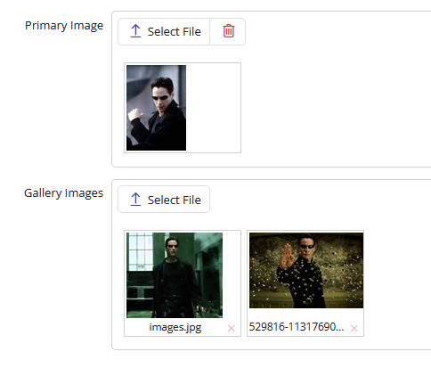

# Managing Primary and Gallery Images

To add primary and gallery images to both Movie and Person records, begin with a database migration:

```csharp
using FluentMigrator;

namespace MovieTutorial.Migrations.DefaultDB
{
    [DefaultDB, Migration(20221122_1151)]
    public class DefaultDB_20221122_1151_PersonMovieImages : AutoReversingMigration
    {
        public override void Up()
        {
            Alter.Table("Person").InSchema("mov")
                .AddColumn("PrimaryImage").AsString(100).Nullable()
                .AddColumn("GalleryImages").AsString(int.MaxValue).Nullable();

            Alter.Table("Movie").InSchema("mov")
                .AddColumn("PrimaryImage").AsString(100).Nullable()
                .AddColumn("GalleryImages").AsString(int.MaxValue).Nullable();
        }
    }
}
```

This migration adds the "PrimaryImage" and "GalleryImages" columns to both the "Person" and "Movie" tables in the database.

### Updating PersonRow and MovieRow

Next, modify the `PersonRow` and `MovieRow` classes to include properties for primary and gallery images:

```csharp
public sealed class PersonRow : Row<PersonRow.RowFields>, IIdRow, INameRow
{
    // ...

    [DisplayName("Primary Image"), Size(100)]
    [ImageUploadEditor(FilenameFormat = "Person/PrimaryImage/~")]
    public string PrimaryImage { get => fields.PrimaryImage[this]; set => fields.PrimaryImage[this] = value; }

    [DisplayName("Gallery Images")]
    [MultipleImageUploadEditor(FilenameFormat = "Person/GalleryImages/~")]
    public string GalleryImages { get => fields.GalleryImages[this]; set => fields.GalleryImages[this] = value; }

    public class RowFields : RowFieldsBase
    {
        // ...
        public StringField PrimaryImage;
        public StringField GalleryImages;
    }
}
```

```csharp
public sealed class MovieRow : Row<MoviesRow.RowFields>, IIdRow, INameRow
{
    // ...
    [DisplayName("Primary Image"), Size(100)]
    [ImageUploadEditor(FilenameFormat = "Movie/PrimaryImage/~")]
    public string PrimaryImage { get => fields.PrimaryImage[this]; set => fields.PrimaryImage[this] = value; }

    [DisplayName("Gallery Images")]
    [MultipleImageUploadEditor(FilenameFormat = "Movie/GalleryImages/~")]
    public string GalleryImages { get => fields.GalleryImages[this]; set => fields.GalleryImages[this] = value; }

    public class RowFields : RowFieldsBase
    {
        // ...
        public StringField PrimaryImage;
        public StringField GalleryImages;
    }
}
```

These modifications allow you to manage primary and gallery images for both Person and Movie records. 

The `FilenameFormat` property within the attributes is used to define the format for image filenames. For instance, the primary image for a Person will be uploaded to a folder located under *App_Data/upload/Person/PrimaryImage/*.

> You have the flexibility to change the upload root (default is *App_Data/upload*) by modifying the *UploadSettings* key in the appsettings.json file.

The use of `~` at the end of the `FilenameFormat` serves as a shortcut for the automatic naming scheme, which is defined as `{1:00000}/{0:00000000}_{2}`.

Here's how this naming scheme works:

- Parameter {0} is replaced with the identity of the record, such as PersonID.

- Parameter {1} represents the identity divided by 1000. This division is helpful for limiting the number of files stored in a single directory.

- Parameter {2} is a unique string, for example, *6l55nk6v2tiyi*. It is used to generate a new file name with every upload. This approach helps prevent caching-related issues on the client side and adds a layer of security since file names cannot be deduced without a specific link.

As a result, a file uploaded for a Person's primary image will be stored at a path like the following:

```plaintext
App_Data\upload\Person\PrimaryImage\00000\00000001_6l55nk6v2tiyi.jpg
```

It's important to note that you are not restricted to this naming scheme and can specify your custom format, like `PersonPrimaryImage_{0}_{2}`.

- The `ImageUploadEditor` stores the file name directly in a string field.

- The `MultipleImageUploadEditor` stores file names in a string field using a JSON array format.

The next step involves adding these fields to the forms in MovieForm.cs and PersonForm.cs:

```csharp
public class PersonForm
{
    //...
    public string PrimaryImage { get; set; }
    public string GalleryImages { get; set; }
}
```

```csharp
public class MovieForm
{
    //...
    public string PrimaryImage { get; set; }
    public string GalleryImages { get; set; }
}
```

Furthermore, there's a modification in the `PersonDialog` class to make it resemble a panel, similar to the Movie dialog:

```typescript
@Decorators.panel()
export class PersonDialog extends EntityDialog<PersonRow, any> {
```

This results in the following user interface:



## Removing Nortwhind and Other Samples

As the project has now reached a good state, it's recommended to remove Northwind and other samples from the MovieTutorial project. For detailed instructions, refer to the how-to topic: [How To: Removing Northwind and Other Samples](../../howto/how_to_remove_sample_modules.md).

