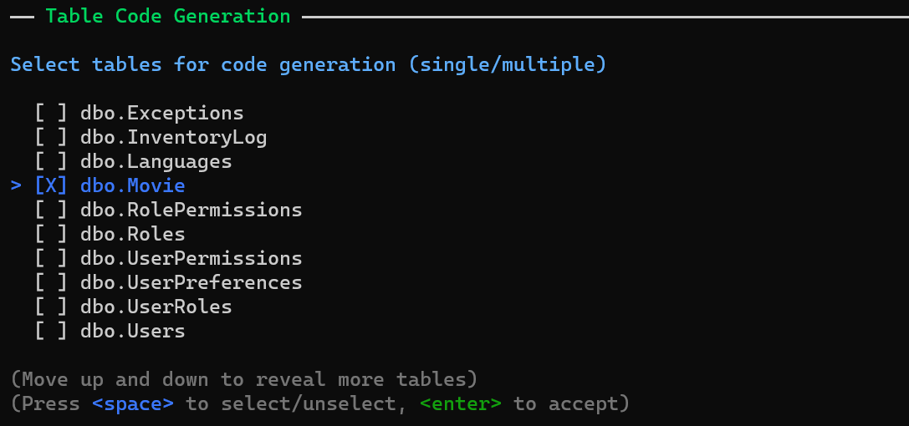

# Generating Code For Movie Table

## Serenity Code Generator

Once you've confirmed that the `Movie` table exists in the database, you can use the Serenity Code Generator (`dotnet sergen`) to generate the initial editing interface.

Since ASP.NET Core has cross-platform support, the .NET Core version of Sergen can run on macOS, Linux, and Windows. Currently, its user interface is console-based.

1. Right-click on the `MovieTutorial.Web` project and select "Open in Terminal."

2. Ensure that you are in the `MovieTutorial.Web` directory.

3. Type `dotnet sergen g` to open the Sergen code generation UI.

> If you encounter an error, type `dotnet restore` and `dotnet tool restore` before running Sergen, and make sure you are inside the `MovieTutorial.Web` directory.

Sergen will list connections found in the `appsettings.json` file.

You can navigate through the connections using the up and down arrow keys. Select the `Default` connection and press Enter.

After pressing `Enter`, you'll receive a list of tables in that database:

Navigate using the up down arrow keys and select the `dbo.Movie` table by pressing Space. Then, press `Enter` to confirm your selection.

Next, Sergen will prompt you for a module name. Please enter `MovieDB`.

> In Serenity terms, a module is a logical group of pages that share a common purpose. 
> 
> For example, in the Serene template, all pages related to the *Northwind* sample belong to the *Northwind* module. Pages that are related to the general management of the site, such as users and roles, belong to the *Administration* module. A module typically corresponds to a database schema or a single database, but you can use multiple modules in a single database/schema or have multiple databases in one module.
>
>For this tutorial, we will use *MovieDB*, which is analogous to IMDB, for all pages.
>
>The module name is used to determine the namespace and URL of the generated pages. For example, our new page will be under the *MovieTutorial.MovieDB* namespace and will use a */MovieDB* relative URL.
>
> #### Please Note!
>
> Module names must be in Pascal case, starting with a capital letter. Invalid module names include `myModule`, `mycoolmodule`, and `aModule`. A valid module name is `MyCoolModule`.

When prompted, please enter `Movie` as the class identifier.

Typically, the class identifier corresponds to the table name. However, in some cases, table names might have underscores or other invalid characters. In such situations, you have the flexibility to choose an appropriate name for your entity in the generated code, as long as it's a valid C# identifier.

Since our table name is *Movie*, which is a valid and appropriate C# identifier, let's use *Movie* as the entity identifier. Our entity class will be named *MovieRow*.

This name also influences other class names. For example, our page controller will be named *MoviePage*. It also determines the page URL; in this sample, our editing page will be located at the URL */MovieDB/Movie*.

 #### Please Note!

The identifier must always be in Pascal case, starting with a CAPITAL letter. Invalid identifier names include `myTable`, `mycoolTable`, and `aTable`. A valid identifier name is `MyCoolTable`.

Leave permission as `Administration:General` and press enter again.

In Serenity, access control to resources (pages, services, etc.) is managed using permission keys, which are simple strings. Users or roles are granted these permissions.

For our Movie page, it will be used exclusively by administrative users (or perhaps content moderators in the future). Therefore, let's set the permission to `Administration:General` for now. In the Serene template, by default, only the `admin` user has this permission.

Next, Sergen will ask you which files to generate. By default the **All** option is preselected, which includes Row, Repository & Service, User Interface, and Custom. Press ENTER one last time.

> If you don't need a UI for a particular entity, you can choose **Row** and **Services** only. If you only want an entity class and not request handlers or service access, select only **Row**.

You can now exit the command prompt and return to Visual Studio to continue your work.

## After Generating Code

1. **REBUILD the Solution** to ensure all changes are applied correctly.

2. Press **F5** to launch the application.

3. Use the username `admin` and the password `serenity` to log in.

4. Once you're on the Dashboard page, you will notice a new section, `MovieDB`, at the bottom of the navigation sidebar.

5. Click to expand it and select **Movie** to open our first generated page.

Now, try adding a new movie, and then attempt to update and delete it.

Sergen generated code for our table, and it works seamlessly without us needing to write a single line of code.

However, it's essential to note that Serenity is not a no-code or low-code platform for non-developers who avoid writing code entirely. The key point here is maintainability. The code produced by some designers and code generators is often an unmanageable mess that developers are discouraged from touching.

Sergen has been invaluable for our initial setup, which is crucial for a layered architecture and adhering to platform standards. Without Sergen, we would need to create approximately 13 files for the entity, request handlers, page, endpoint, grid, form, and more. We would also need to set up configurations in a few other places.

Even if we copied and pasted code from another page, it could be error-prone and take about 5-10 minutes.

The code files generated by Sergen contain the essential code with a focus on efficiency. This is made possible by the base classes in Serenity that handle most of the logic. Once we generate code for a table, we're unlikely to use Sergen again for that table. Instead, we'll modify the generated code to meet our specific requirements. We'll explore how to do that.
