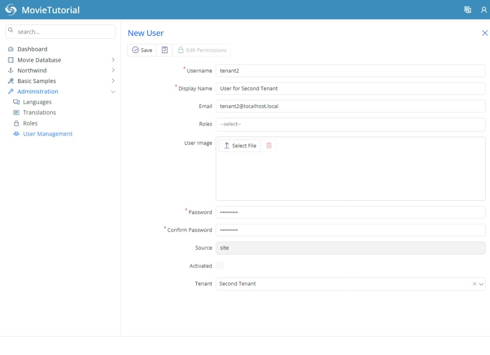

# Tenant Selection in User Dialog

We have added a TenantId field to the Users table; however, it is not yet defined in `UserRow`, and it is not visible in the user dialog.

This field should only be visible and editable by the _admin_ user. Other users, even if granted access to the users page to manage their tenant users, should not be able to view or modify this information.


First, add the field to `UserRow.cs`:

```cs
namespace MovieTutorial.Administration;
//...
public sealed class UserRow : Serenity.Extensions.Entities.LoggingRow<UserRow.RowFields>, IIdRow, INameRow, IIsActiveRow, IDisplayNameRow, IEmailRow, IPasswordRow
{
    //...
    [DisplayName("Last Directory Update"), Insertable(false), Updatable(false)]
    public DateTime? LastDirectoryUpdate { get => fields.LastDirectoryUpdate[this]; set => fields.LastDirectoryUpdate[this] = value; }

    [DisplayName("Tenant"), ForeignKey("Tenants", "TenantId"), LeftJoin("tnt")]
    [LookupEditor(typeof(TenantRow))]
    public int? TenantId { get => Fields.TenantId[this]; set => Fields.TenantId[this] = value; }

    [DisplayName("Tenant"), Expression("tnt.TenantName")]
    public string TenantName { get => Fields.TenantName[this]; set => Fields.TenantName[this] = value; }

    //...
    public class RowFields : Serenity.Extensions.Entities.LoggingRowFields
    {
        //...
        public DateTimeField LastDirectoryUpdate;
        public StringField Password;
        public StringField PasswordConfirm;
        //...
    }
}

```

To enable editing of this field, add `TenantId` to `UserForm.cs`:

```cs
namespace MovieTutorial.Administration.Forms;

[FormScript("Administration.User")]
[BasedOnRow(typeof(UserRow), CheckNames = true)]
public class UserForm
{
    //...
    [OneWay]
    public string Source { get; set; }
    public bool IsActive { get; set; }
    public int? TenantId { get; set; }
}
```

Open the User Management page and create a user named _tenant2_ that belongs to Second Tenant.



After creating this user, edit its permissions and grant him *User, Role Management and Permissions* permission as this will be our administrative user for *Second Tenant*.

## Logging In With  _Tenant2_ 

Signout and login with user _tenant2_.

When you open *User Management* page, you may encounter one of two scenarios:

In first case, _tenant2_ can open the user dialog and change their own and other users' tenants. This occurs if your browser has cached the tenant lookup.
In the second case, _tenant2_ cannot open the user dialog. When you click a user, you will see an error.

```
Access denied while trying to load the lookup: "Administration.Tenant". Please check if current user has required permissions for this lookup.

Lookups use the ReadPermission of their row by default. You may override that for the lookup like [LookupScript("Some.Lookup", Permission = "?")] to grant all authenticated users to read it (or use "*" for public).

Note that this might be a security risk if the lookup contains sensitive data, so it could be better to set a separate permission for lookups, like "MyModule:Lookups".
```

This error occurs because our `TenantRow` has _Administration:Tenants_ read permission, which is inherited by the lookup script.

Changing the read permission for the tenant lookup script to something else could resolve this error, but it would allow _ _Tenant2_ _ to see and change the tenant of themselves and any other user, including the _admin_.

This is not the desired behavior.

Let's first prevent _ _Tenant2_ _ from seeing users of other tenants.