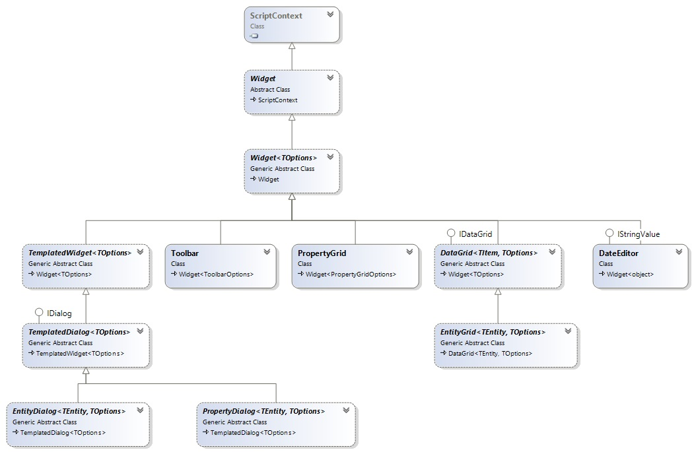

# Widget Class

## Widget Class Diagram



## A sample Widget

Let's build a widget, that increases a DIV's font size everytime it is clicked:

```cs
namespace MySamples
{
    public class MyCoolWidget : Widget
    {
        private int fontSize = 10;

        public MyCoolWidget(jQueryObject div)
            : base(div)
        {
            div.Click(e => {
                fontSize++;
                this.Element.Css("font-size", fontSize + "pt");
            });
        }
    }
}
```

```html
<div id="SomeDiv">Sample Text</div>
```

We can create this widget on an HTML element, like:

```cs
var div = jQuery.Select("#SomeDiv");
new MyCoolWidget(div);
```

## Widget Class Members

```cs
public abstract class Widget : ScriptContext
{
    private static int NextWidgetNumber = 0;

    protected Widget(jQueryObject element);
    public virtual void Destroy();

    protected virtual void OnInit();
    protected virtual void AddCssClass();

    public jQueryObject Element { get; }
    public string WidgetName { get; }
    public string UniqueName { get; }
}
```

### *Widget.Element* Property

Classes derived from Widget can get the element, on which they are created, by the `Element` property.

```cs
public jQueryObject Element { get; }
```

This property has type of jQueryObject and returns the element, which is used when the widget is created. In our sample, container DIV element is referenced as `this.Element` in the click handler.

### HTML Element and Widget *CSS Class*

When a widget is created on an HTML element, it does some modifications to the element.

First, the HTML element gets a CSS class, based on the type of the widget.

In our sample, `.s-MyCoolWidget` class is added to the `DIV` with ID `#SomeDiv`.

Thus, after widget creation, the DIV looks similar to this:

```html
<div id="SomeDiv" class="s-MyCoolWidget">Sample Text</div>
```

This CSS class is generated by putting a `s-` prefix in front of the widget class name (it can be changed by overriding Widget.AddCssClass method).

### Styling the HTML Element With Widget CSS Class

Widget CSS class can be used to style the HTML element that the widget is created on.

```css
.s-MyCoolWidget {
	background-color: red;
}
```

### Getting a Widget Reference From an HTML Element with the *jQuery.Data* Function

Along with adding a CSS class, another information about the widget is added to the HTML element, though it is not obvious on markup. This information can be seen by typing following in Chrome console:

```js
> $('#SomeDiv').data()

> Object { MySamples_MyCoolWidget: $MySamples_MyCoolWidget }
```

Thus, it is possible to get a reference to a widget that is attached to an HTML element, using `$.data` function. In C# this can be written as:

```cs
var myWidget = (MyCoolWidget)(J("#SomeDiv").GetDataValue('MySamples_MyCoolWidget'));
```

### WidgetExtensions.GetWidget Extension Method

Instead of the prior line that looks a bit long and complex, a Serenity shortcut can be used:

```cs
var myWidget = J("#SomeDiv").GetWidget<MyCoolWidget>();
```

This piece of code returns the widget if it exists on HTML element, otherwise throws an exception:

```text
Element has no widget of type 'MySamples_MyCoolWidget'!
```

### WidgetExtensions.TryGetWidget Extension Method

TryGetWidget can be used to check if the widget exists, simply returning `null` if it doesn't:

```cs
var myWidget = $('#SomeDiv').TryGetWidget<MyCoolWidget>();
```


### Creating Multiple Widgets on an HTML Element

Only one widget of the same class can be attached to an HTML element.

An attempt to create a secondary widget of the same class on a element throws the following error:

```text
The element already has widget 'MySamples_MyCoolWidget'.
```

Any number of widgets from different classes can be attached to a single element as long as their behaviour doesn't affect each other.

### Widget.*UniqueName* Property

Every widget instance gets a unique name like `MySamples_MyCoolWidget3` automatically, which can be accessed by `this.UniqueName` property.

This unique name is useful as a ID prefix for the HTML element and its descendant elements which may be generated by the widget itself.

It can also be used as an event class for `$.bind` and `$.unbind' methods to attach / detach event handlers without affecting other handlers, which might be attached to the element:

```cs
jQuery("body").Bind("click." + this.UniqueName, delegate { ... });
...

jQUery("body").Unbind("click." + this.UniqueName);
```

### Widget.Destroy Method

Sometimes releasing an attached widget might be required without removing the HTML element itself.

Widget class provides `Destroy` method for the purpose.

In default implementation of the Destroy method, event handlers which are assigned by the widget itself are cleaned (by using UniqueName event class) and its CSS class (`.s-WidgetClass`) is removed from the HTML element.

Custom widget classes might need to override Destroy method to undo changes on HTML element and release resources (though, no need to detach handlers that are attached previously with UniqueName class)

Destroy method is called automatically when the HTML element is detached from the DOM. It can also be called manually.

If destroy operation is not performed correctly, memory leaks may occur in some browsers.

